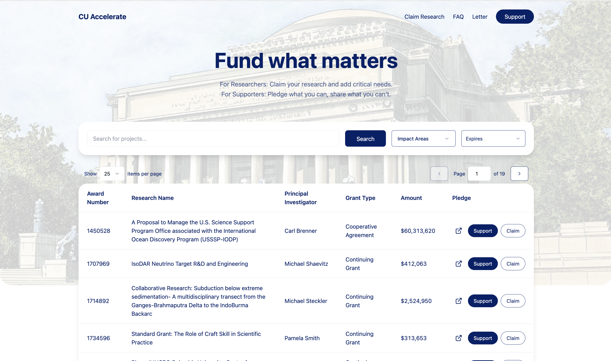

# Accelerate Columbia

Accelerate Columbia is a crowdsourcing fundraising platform designed to support research projects affected by recent $400M federal funding cuts. The platform enables researchers to claim their research projects and outline critical needs, while allowing supporters to make pledges and share projects with their networks.



## About the Project

This platform serves as a bridge between Columbia University researchers and potential supporters during a challenging period of federal funding reductions. It provides a transparent way to:

- For Researchers: Claim research projects and specify critical funding needs
- For Supporters: Make pledges and share projects with their networks
- For the University: Track and manage funding pledges for affected research

## Tech Stack

- **Framework**: Next.js App Router
- **Runtime**: Bun
- **Database**: Supabase
- **Styling**: Tailwind CSS with shadcn/ui components
- **State Management**: React Hooks
- **Form Handling**: React Hook Form with Zod validation

## Getting Started

### Prerequisites

- Node.js 18+ or Bun
- Supabase account and project
- Environment variables (see `.env.example`)

### Installation

1. Clone the repository:

```bash
git clone https://github.com/yourusername/cu-accelerate.git
cd cu-accelerate
```

2. Install dependencies:

```bash
bun install
```

3. Set up environment variables:

```bash
cp .env.example .env.local
# Edit .env.local with your Supabase credentials
```

4. Run the development server:

```bash
bun run dev
```

The application will be available at `http://localhost:3000`.

## Project Structure

- `/app` - Next.js App Router pages and layouts
- `/components` - Reusable React components
- `/lib` - Utility functions and configurations

## Contributing

1. Fork the repository
2. Create your feature branch (`git checkout -b feature/amazing-feature`)
3. Commit your changes (`git commit -m 'Add some amazing feature'`)
4. Push to the branch (`git push origin feature/amazing-feature`)
5. Open a Pull Request

## Important Note About Funding

This platform serves as a pledge management system and does not directly handle any financial transactions. All pledges made through this platform are recorded and passed to Columbia University's endowment and fundraising committee for processing. The actual handling of funds, including collection, management, and distribution, is managed entirely by Columbia University's official fundraising channels.

## License

Authored by Alexa Kayman, Alex Denuzzo, and Joseph Jojoe. We are open-sourcing this so more people can contribute. All rights reserved.
